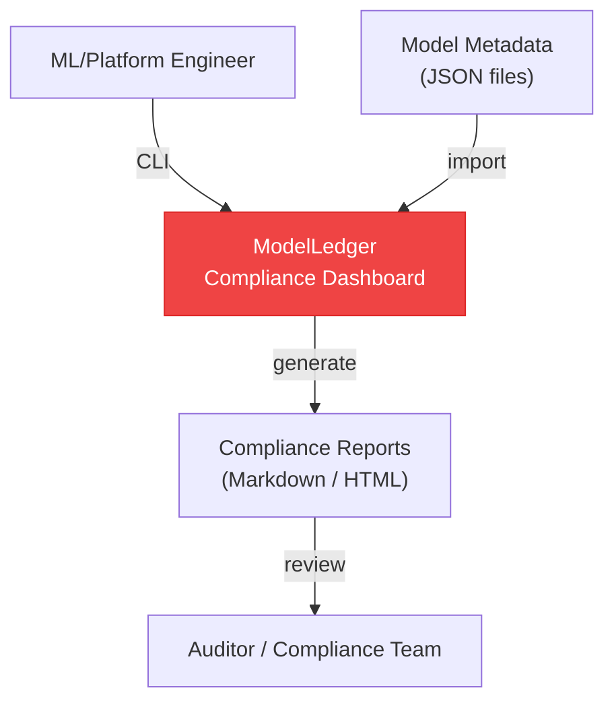
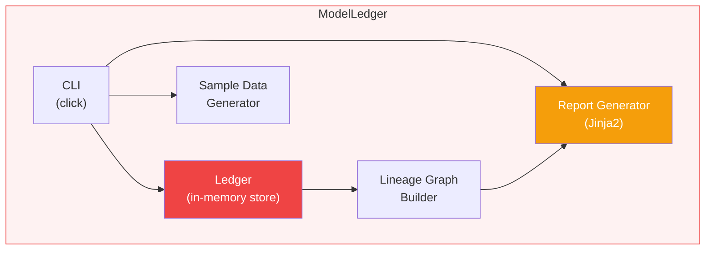
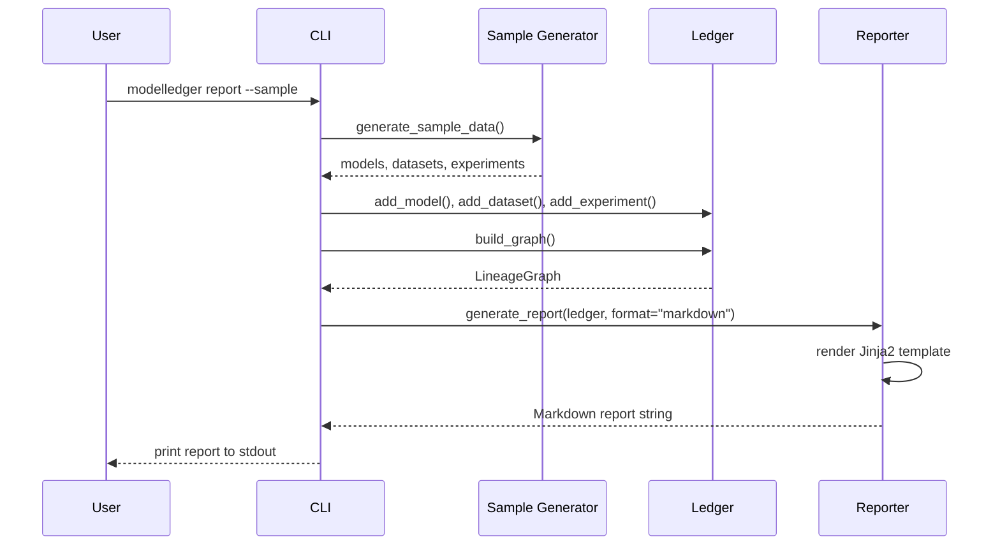

# ModelLedger Architecture

## Overview

ModelLedger is an MLOps compliance tool that tracks model lineage (model → dataset → experiment → deployment) and generates audit reports. It works entirely locally with JSON data files, with optional integrations planned for MLflow, DVC, and Langfuse.

## C4 Diagrams

### Level 1: System Context

### Level 2: Container Diagram

### Sequence Diagram: Report Generation

## Design Decisions

### Local-First vs. Service-Based

**Chose:** CLI tool that works with local JSON files.

**Why:** Zero infrastructure requirements. Teams can start using it immediately by exporting their existing metadata to JSON. Service integrations (MLflow, DVC API) are planned as optional importers.

### Jinja2 Reports vs. Dashboard UI

**Chose:** Jinja2 template-based report generation (Markdown/HTML).

**Why:** Reports are portable, version-controllable, and can be generated in CI. A web dashboard adds deployment complexity inappropriate for v0.1.

## Extension Points

1. MLflow importer (API-based)
2. DVC importer (metadata parsing)
3. Langfuse importer (production traces)
4. Custom report templates
5. Risk scoring algorithms
